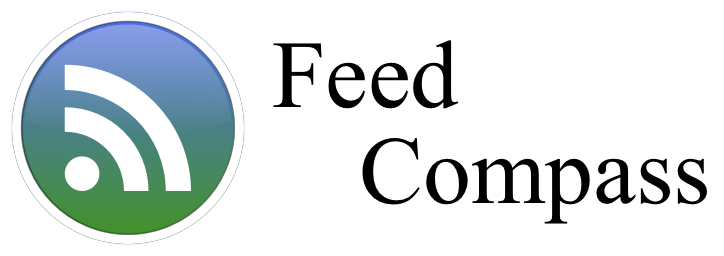

# 

Feed Compass is a macOS application that makes it easier to find and subscribe
to RSS Feeds in your favorite RSS Reader.  It is a companion app to an RSS
Reader so you will need one of those to make Feed Compass usable.

There are lots of Mac RSS Readers available in the Mac App Store.  If you are
looking for a good, free RSS Reader we recommend 
[NetNewsWire](https://ranchero.com/netnewswire/).

It is currently in development, but is usable right now.  You can download it
here: [Feed Compass Download](http://vincode.io/Feed%20Compass.app.zip)

## Contributing

Pull requests are welcome.  If you are a non-technical person and want to
contribute you can file bug reports and feature requests on the 
[Issues](https://github.com/vincode-io/FeedCompass/issues) page.

If you have an OPML file that you think should be included, please file
an [Issue](https://github.com/vincode-io/FeedCompass/issues) for it.

## Building

From the command line run the following commands:
```
git clone https://github.com/vincode-io/FeedCompass.git
cd FeedCompass
git submodule init
git submodule update
```

You can now open the Feed Compass.xcodeproj project.  You will have to fix
the project signing before building and running.

## Licence

MIT Licensed

## Credits

Many thanks to [Brent Simmons](http://inessential.com) for the coming up with
the idea for this program.  We would also like to thank him for open sourcing
the many libraries of his we use.

We would also like to thank the creators of the OPML files utilized by Feed
Compass.  This program would be nothing without their work curating the OMPL
blog listings.
